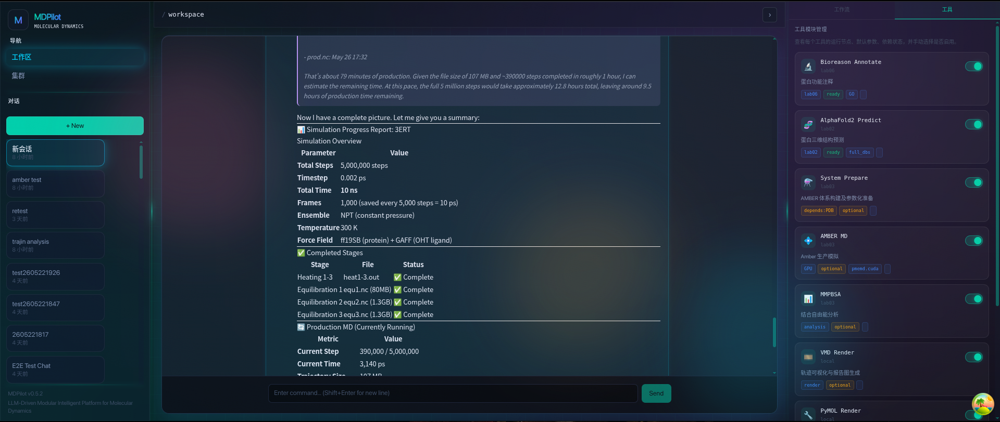
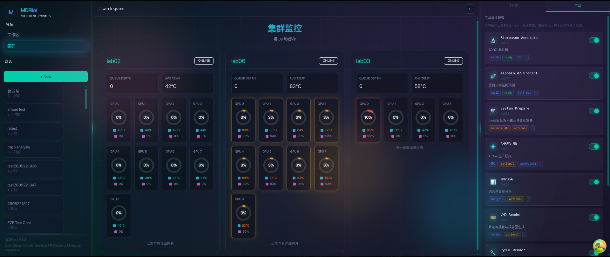

<!--
╔══════════════════════════════════════════════════════════════════════╗
║  DreamSeed 种梦计划 — AI创造者大赛  官方 README 模板                ║
║                                                                      ║
║  使用说明：                                                          ║
║  1. 将本模板放在参赛仓库根目录 README.md 的顶部                       ║
║  2. 头图使用 DreamField 官方公开活动图片地址                         ║
║  3. 请保留 DREAMFIELD_README_HEADER_START / END 标识                 ║
║  4. 分割线以下供创作者自由编写项目内容                               ║
╚══════════════════════════════════════════════════════════════════════╝
-->

<!-- DREAMFIELD_README_HEADER_START -->

<p align="center">
  <a href="https://www.dreamfield.top">
    
  </a>
</p>

<!-- DREAMFIELD_README_HEADER_END -->

<div align="center">

# MDPilot

**AI-Powered Molecular Dynamics Assistant**

[](https://python.org)
[](https://react.dev)
[](https://fastapi.tiangolo.com)
[](https://ambermd.org)
[](https://github.com/google-deepmind/alphafold)
[](https://github.com/bowang-lab/BioReason-Pro)
[](LICENSE)

<p><em>An intelligent multi-agent system that automates AMBER molecular dynamics simulations,
AlphaFold2 structure prediction, and bio-molecular reasoning through natural language interaction.</em></p>

[Features](#-features) · [Architecture](#-architecture) · [Quick Start](#-quick-start) · [API](#-api-overview)

**[English](README.md) · [简体中文](README_CN.md)**

</div>

---

<p align="center">
<video src="photos&videos/display_02.mp4" autoplay loop muted playsinline width="100%"></video>
</p>

## Features

- **Natural Language MD Workflows** — Describe your simulation goals in plain text; MDPilot plans, executes, and monitors the entire pipeline: system preparation, minimization, equilibration, and production MD.
- **AlphaFold2 Integration** — Submit protein structure prediction jobs to remote GPU clusters directly from chat.
- **Bio-Molecular Reasoning** — Powered by BioReason for mutation annotation, structure-function analysis, and domain expertise.
- **Multi-Paradigm Agents** — Three specialized agent architectures (ReAct, Plan-and-Solve, Reflection) automatically selected based on task complexity.
- **Remote HPC Orchestration** — Execute simulations on multi-node GPU clusters via SSH + Celery, with real-time monitoring.
- **Real-Time Streaming UI** — SSE-powered chat with live agent thinking, tool execution, and plan progress visualization.
- **Comprehensive Tool Suite** — 20+ built-in tools covering AMBER (tleap, sander, pmemd, cpptraj, antechamber), PDB operations, PROPKA pKa prediction, H++ protonation, and more.
- **Dual Interface** — React web UI and terminal UI (Textual/Ratatui).

## Architecture

```text
┌─────────────────────────────────────────────────────────────────────┐
│                      React Frontend (Vite + Radix)                  │
│                                                                     │
│   Chat Pane          Workflow Panel         Cluster Monitor         │
│   · SSE Streaming    · Tool Cards           · GPU Usage Rings       │
│   · Markdown Render  · Progress Bars        · Node Health           │
│   · Code Highlight   · AlphaFold2 Card      · Real-time WS          │
└──────────────────────────────┬──────────────────────────────────────┘
                               │  SSE / WebSocket / REST
┌──────────────────────────────▼──────────────────────────────────────┐
│                       FastAPI Backend                                │
│                                                                     │
│   Routers ─── Services ─── Auth ─── Middleware                       │
│   · /agent/chat (SSE)                                               │
│   · /bioreason/*  /alphafold2/*                                     │
│   · /chats  /tasks  /health                                         │
├─────────────────────────────────────────────────────────────────────┤
│                        Agent Layer                                   │
│                                                                     │
│   ┌───────────┐  ┌────────────────┐  ┌────────────┐                │
│   │   ReAct   │  │ Plan-and-Solve │  │ Reflection │                │
│   │ (simple)  │  │ (workflows)    │  │ (optimize) │                │
│   └─────┬─────┘  └───────┬────────┘  └─────┬──────┘                │
│         └────────────────┼──────────────────┘                       │
│                AgentBase (shared infrastructure)                     │
│                                                                     │
│   LLMCaller · ToolDispatcher · ContextManager · BudgetTracker       │
│   SkillRegistry · Checkpoint · DependencyGraph · ParallelExecutor   │
│   KnowledgeInjector · ErrorClassifier · RecoveryCoordinator         │
├─────────────────────────────────────────────────────────────────────┤
│                       Tool Registry                                  │
│                                                                     │
│   AMBER ─ tleap · sander · pmemd · cpptraj · antechamber · pdb4amber│
│   AlphaFold2 · BioReason · PDB (fetch/clean/info)                   │
│   PROPKA · H++ · Bash · File Ops · SSH · Knowledge · Wizards       │
├─────────────────────────────────────────────────────────────────────┤
│                     Integrations                                     │
│                                                                     │
│   RemoteToolClient ── Celery Workers ── SSH Executor                │
│   AlphaFold2 Client          BioReason Client                       │
├─────────────────────────────────────────────────────────────────────┤
│              Database (SQLAlchemy 2.0 Async ORM)                     │
│                                                                     │
│   Chat · Message · Task · AgentSession                              │
└─────────────────────────────────────────────────────────────────────┘
```

## Agent Paradigms

| Paradigm           | Class               | Trigger                        | Behavior                                                    |
|:-------------------|:--------------------|:-------------------------------|:------------------------------------------------------------|
| **ReAct**          | `ReActAgent`        | Simple Q&A, single-tool tasks  | Reason → Act → Observe loop with tool use                   |
| **Plan-and-Solve** | `PlanAndSolveAgent` | Multi-step workflows (MD, AF2) | Decompose task → generate plan → execute steps sequentially |
| **Reflection**     | `ReflectionAgent`   | Optimization, debugging        | Execute → critique → revise loop with self-evaluation       |

The `AgentRouter` uses `TaskClassifier` to automatically select the optimal paradigm for each user request. Agents share a common `AgentBase` providing LLM calling, tool dispatch, context compression, budget tracking, error recovery, and skill loading.

<p align="center">

</p>

## Tech Stack

<table>
<tr><th>Backend</th><th>Frontend</th></tr>
<tr>
<td>

- **FastAPI** + Uvicorn (async web)
- **SQLAlchemy 2.0** async ORM
- **LiteLLM** (multi-provider LLM gateway)
- **Pydantic v2** (validation & settings)
- **AsyncSSH** (remote execution)
- **Celery** + Redis (distributed tasks)
- **Alembic** (database migrations)
- **Textual** / **PyRatatui** (TUI)

</td>
<td>

- **React 18** + Vite
- **Tailwind CSS** + Radix UI
- **Zustand** (state management)
- **SSE** streaming with event parsing
- **WebSocket** real-time updates
- **MSW** (mock service worker)
- **Vitest** + Testing Library
- **Playwright** (E2E)

</td>
</tr>
</table>

## Project Structure

```text
src/mdpilot/                          # Backend (196 Python modules)
├── agent/                            # Multi-paradigm agent core
│   ├── base.py                       # AgentBase — shared infrastructure
│   ├── react_agent.py                # ReAct paradigm
│   ├── plan_solve.py                 # Plan-and-Solve paradigm
│   ├── reflection.py                 # Reflection paradigm
│   ├── router.py                     # Paradigm router
│   ├── task_classifier.py            # Task → paradigm mapping
│   ├── orchestrator.py               # Multi-agent orchestration
│   ├── skills.py                     # Dynamic skill loading
│   ├── knowledge_injector.py         # Domain knowledge injection
│   ├── context_compressor.py         # Context window management
│   ├── parallel_executor.py          # Parallel tool execution
│   ├── dependency_graph.py           # Tool dependency resolution
│   ├── checkpoint.py                 # State persistence & recovery
│   ├── error_classifier.py           # Error categorization
│   ├── recovery_coordinator.py       # Failure recovery strategies
│   ├── budget.py                     # Token/cost budget tracking
│   └── monitoring.py                 # Agent metrics & observability
├── api/                              # FastAPI application layer
│   ├── app.py                        # App factory & lifecycle
│   ├── routers/                      # REST, SSE & WebSocket endpoints
│   ├── services/                     # Business logic layer
│   ├── models/                       # Pydantic request/response schemas
│   ├── middleware/                    # Logging & CORS middleware
│   └── websockets/                   # WebSocket handlers
├── tools/                            # Tool registry & built-in tools
│   ├── registry.py                   # Auto-discovery tool registration
│   ├── dispatcher.py                 # Tool execution dispatch
│   ├── security.py                   # Tool sandbox & permission control
│   ├── wizards/                      # Interactive tool wizards
│   │   ├── engine.py                 # Wizard execution engine
│   │   └── manifests/                # YAML wizard definitions
│   └── builtin/                      # 20+ built-in tools
│       ├── amber/                    # tleap, sander, pmemd, cpptraj, antechamber, pdb4amber, reduce
│       ├── alphafold2/               # Structure prediction
│       ├── bioreason/                # Bio-molecular reasoning
│       ├── pdb/                      # PDB fetch, clean, info
│       ├── hplusplus.py              # H++ protonation server
│       ├── propka.py                 # PROPKA pKa prediction
│       ├── bash.py                   # Shell command execution
│       ├── file_ops.py               # File I/O operations
│       └── ssh_tools.py              # Remote SSH commands
├── integrations/                     # Remote service clients
│   ├── alphafold2/                   # AlphaFold2 Celery client
│   ├── bioreason/                    # BioReason Celery client
│   └── base/                         # Remote tool client base class
├── coordination/                     # Workflow coordination layer
│   ├── execution_planner.py          # Execution plan generation
│   ├── plan_generator.py             # Plan step decomposition
│   ├── plan_validator.py             # Plan correctness validation
│   ├── resource_guard.py             # Resource limit enforcement
│   └── validators/                   # Multi-level validators
├── database/                         # Async ORM data layer
│   ├── models/                       # SQLAlchemy models (Chat, Message, Task, Session)
│   ├── repositories/                 # Typed data access layer
│   ├── engine.py                     # Async engine factory
│   └── session.py                    # Session management
├── workflows/                        # MD workflow definitions
│   ├── standard_protein.py           # Standard protein MD workflow
│   ├── protonation.py                # Protonation state handling
│   ├── build_recorder.py             # Build step recording
│   └── validator.py                  # Workflow validation
├── knowledge/                        # Domain knowledge base
│   ├── index.py                      # Knowledge retrieval index
│   └── loader.py                     # Knowledge source loader
├── llm/                              # LLM provider abstraction
│   ├── provider.py                   # Multi-provider LLM interface
│   └── fallback.py                   # Provider fallback chain
├── config/                           # Configuration system
├── cli/                              # CLI commands (Typer)
├── tui/                              # Textual terminal UI
├── tui_pyratatui/                    # PyRatatui terminal UI
├── ui/                               # Rich progress & result panels
├── pipelines/                        # Data processing pipelines
└── plan_legacy/                      # Legacy plan executor

mdpilot-frontend/src/                 # Frontend (159 TypeScript modules)
├── app/                              # App shell, layouts, routing
│   ├── App.tsx                       # Root component
│   ├── router.tsx                    # Route configuration
│   ├── layouts/                      # WorkspaceLayout, Sidebar, Topbar, RightPanel
│   └── providers.tsx                 # Context providers
├── features/
│   ├── chat/                         # Chat feature module
│   │   ├── components/               # ChatPane, MessageList, AgentBlock, ToolCard, Markdown
│   │   ├── hooks/                    # useAgentChat, useChatSocket, useSendMessage
│   │   ├── store/                    # Zustand chat state
│   │   └── api/                      # SSE parsing, API calls
│   ├── workflow/                     # Workflow panel feature
│   │   ├── components/               # ToolCard, AlphaFold2Card, AmberCard, ProgressBar
│   │   ├── hooks/                    # useWorkflowSync
│   │   └── store/                    # Zustand workflow state
│   └── cluster/                      # GPU cluster monitoring
│       ├── components/               # ClusterMonitorPage, NodeCard, GpuRing
│       ├── hooks/                    # useNodes
│       └── api/                      # Node status API
├── shared/                           # Shared utilities
│   ├── api/                          # Axios instance, error handling, health check
│   ├── ws/                           # WebSocket client with auto-reconnect
│   ├── hooks/                        # Shared React hooks
│   ├── ui/                           # Reusable UI components (Button, ScrollArea, etc.)
│   ├── utils/                        # Time formatting, class names, path utils
│   ├── config/                       # Environment configuration
│   └── types/                        # Shared TypeScript types
├── components/                       # Global components (background effects)
└── mocks/                            # MSW handlers, fixtures, mock WebSocket servers

tests/                                # Test suite (204 test files)
```

## Quick Start

### Prerequisites

- Python 3.10+
- Node.js 20+ with pnpm
- AMBER (optional, for simulation features)
- Redis + Celery worker (optional, for distributed remote tools)

### Backend

```bash
git clone https://github.com/nowa277/mdpilot.git
cd mdpilot

python -m venv .venv && source .venv/bin/activate
pip install -e ".[dev]"

cp .env.example .env
# Edit .env — set MDPILOT_API_KEY and other settings

mdpilot db upgrade                    # Initialize database

uvicorn mdpilot.api.app:create_app --factory --host 0.0.0.0 --port 18003
```

### Frontend

```bash
cd mdpilot-frontend
pnpm install

cp .env.example .env
# Edit .env — set VITE_API_URL to your backend endpoint

pnpm dev
```

### Environment Variables

| Variable               | Description               | Default                            |
|:-----------------------|:--------------------------|:-----------------------------------|
| `MDPILOT_API_KEY`      | LLM provider API key      | *Required*                         |
| `MDPILOT_BASE_URL`     | Custom API endpoint       | Provider default                   |
| `MDPILOT_MODEL`        | LLM model name            | `claude-sonnet-4-20250514`         |
| `MDPILOT_DATABASE_URL` | Database connection string | `sqlite+aiosqlite:///./mdpilot.db` |

See `.env.example` for the complete list.

## API Overview

| Endpoint                      | Method   | Description           |
|:------------------------------|:---------|:----------------------|
| `/health`                     | GET      | Service health check  |
| `/api/v1/chats`               | GET/POST | Chat CRUD             |
| `/api/v1/chats/{id}/messages` | GET/POST | Message history       |
| `/api/v1/agent/chat`          | POST     | Agent SSE stream      |
| `/api/v1/agent/task`          | POST     | Async task submission |
| `/api/v1/bioreason/*`         | POST     | BioReason endpoints   |
| `/api/v1/alphafold2/*`        | POST     | AlphaFold2 endpoints  |

The agent chat endpoint returns **Server-Sent Events** with structured types:

| Event         | Description                     |
|:--------------|:--------------------------------|
| `thinking`    | Agent reasoning step            |
| `tool_call`   | Tool invocation with parameters |
| `tool_result` | Tool execution output           |
| `plan_step`   | Plan-and-Solve step update      |
| `text_delta`  | Streaming text response         |
| `done`        | Stream completion               |

## Remote Cluster Setup

MDPilot executes simulations on remote HPC nodes via SSH:

1. **Configure nodes** — Add cluster node addresses, SSH credentials, and conda paths in application settings.
2. **Celery workers** — Each compute node runs a Celery worker for distributed task execution (AlphaFold2, BioReason).
3. **Redis broker** — Serves as the Celery message broker connecting the backend to remote workers.
4. **SSH executor** — Handles file transfer (SFTP) and command execution for AMBER simulations.

<p align="center">

</p>

## Testing

```bash
# Backend
pytest                                # Run all tests
pytest tests/agent/                   # Agent module tests
pytest tests/ -m "not slow"          # Skip slow integration tests

# Frontend
cd mdpilot-frontend
pnpm test                            # Vitest unit tests
pnpm test:cov                        # With coverage report
```

## Stats

| Metric                      | Count |
|:----------------------------|:------|
| Backend Python modules      | 196   |
| Frontend TypeScript modules | 159   |
| Test files                  | 204   |
| Built-in tools              | 20+   |
| Agent paradigms             | 3     |

## Acknowledgments

MDPilot builds on the following open-source projects and services:

| Project        | Description                         | Reference                                                                                                   |
|:---------------|:------------------------------------|:------------------------------------------------------------------------------------------------------------|
| **AMBER**      | Molecular dynamics simulation suite | [ambermd.org](https://ambermd.org) · [Case et al., 2024](https://doi.org/10.1021/acs.jctc.4c00050)          |
| **AlphaFold2** | Protein structure prediction        | [DeepMind](https://github.com/google-deepmind/alphafold) · [Jumper et al., 2021](https://doi.org/10.1038/s41586-021-03819-2) |
| **BioReason**  | Bio-molecular reasoning engine      | [github.com/bowang-lab/BioReason-Pro](https://github.com/bowang-lab/BioReason-Pro)                                            |

## License

[Apache-2.0](LICENSE)

